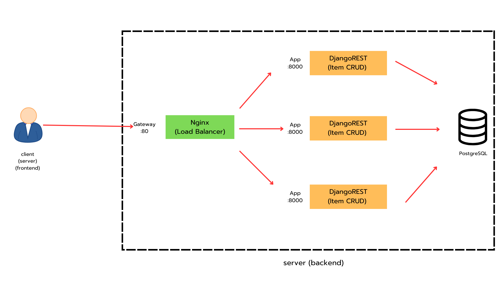

# django101 (project นี้จัดทำขึ้นมาเพื่อใช้ฝึกฝนก่อนไปทำงาน)

## Structure


## Run

Go to the project directory

```bash
  cd django101
```

Docker Compose Build

```bash
  docker-compose up --build -d
```

Close

```bash
  docker-compose down
```